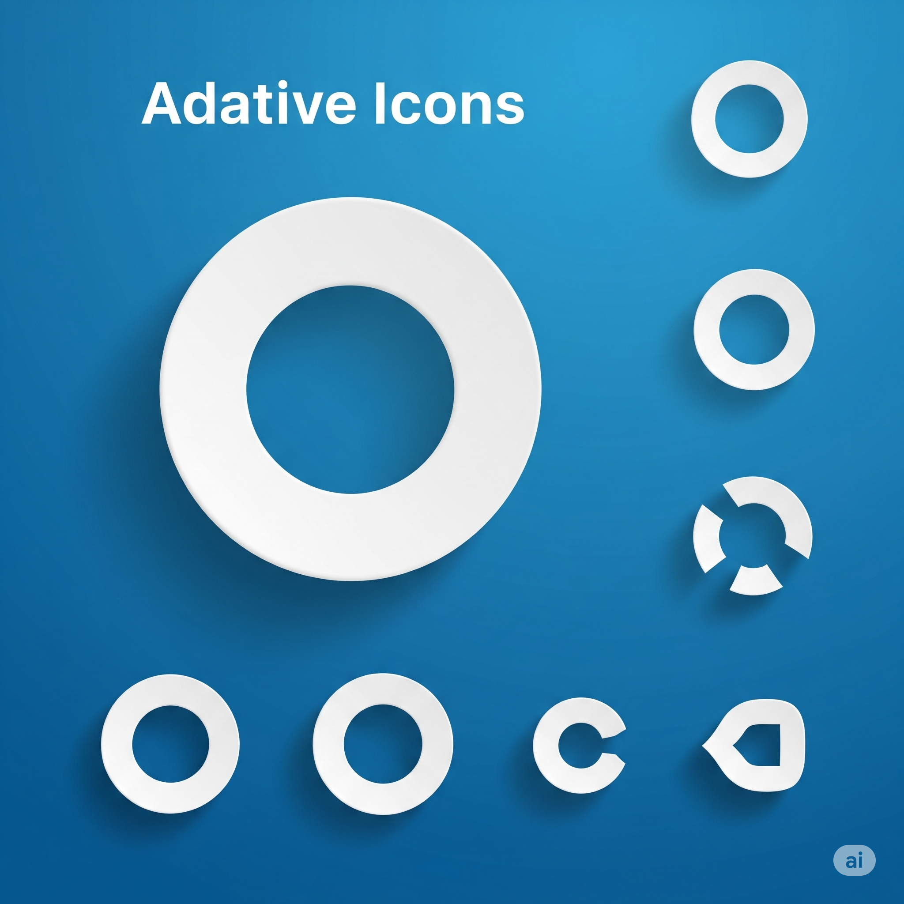
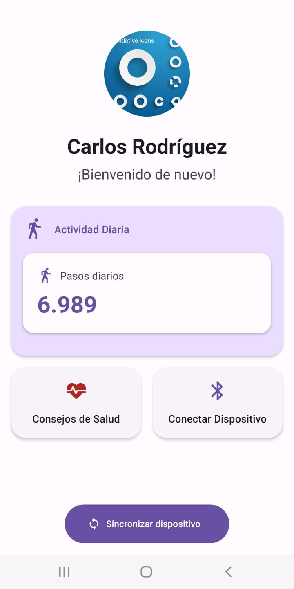
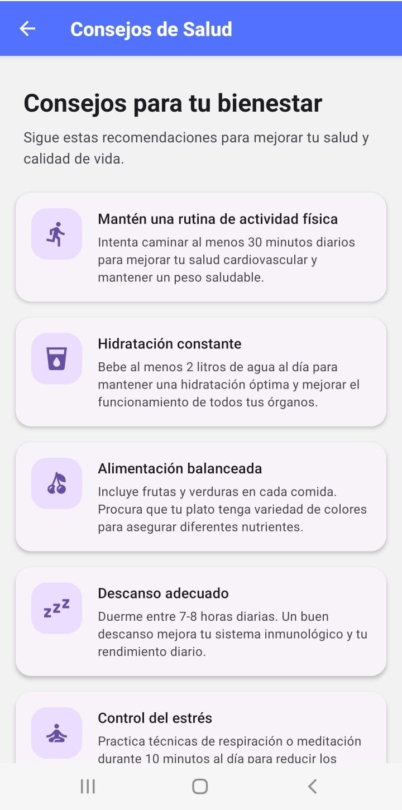
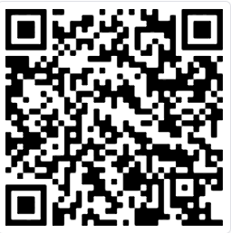

# TakeMed App

<div align="center">
  
</div>

Aplicación móvil para el seguimiento de actividad física y sincronización con dispositivos BLE.

## 📱 Capturas de Pantalla

### Pantalla Principal (Home)

<div align="center">
  
</div>

La pantalla principal presenta una interfaz moderna y minimalista con las siguientes características:

- **Perfil del Usuario**: Muestra el avatar y nombre del usuario con un mensaje de bienvenida personalizado
- **Contador de Pasos**: Visualización clara de la actividad diaria con un contador de pasos actualizado en tiempo real
- **Tarjetas de Acceso Rápido**:
  - Consejos de Salud: Acceso directo a recomendaciones personalizadas
  - Conectar Dispositivo: Gestión de la conexión BLE con el dispositivo
- **Botón de Sincronización**: Ubicado en la parte inferior, permite sincronizar datos con animaciones de feedback

### Pantalla de Consejos de Salud

<div align="center">
  
</div>

La sección de consejos de salud ofrece una experiencia informativa y útil:

- **Diseño por Tarjetas**: Cada consejo se presenta en una tarjeta individual con:
  - Iconos intuitivos que representan el tipo de consejo
  - Títulos claros y descriptivos
  - Descripciones detalladas y fáciles de entender
- **Categorías Variadas**: Incluye consejos sobre:
  - Ejercicio y actividad física
  - Nutrición y alimentación saludable
  - Bienestar general y salud mental
  - Rutinas y hábitos saludables
- **Navegación Fluida**: Desplazamiento suave entre consejos con una interfaz responsive

## 📲 Instalación de la App

### Versión de Desarrollo (Android)

Escanea el siguiente QR con la aplicación Expo Go:

<div align="center">
  
</div>

### Versión de Producción (Instalable)

Escanea el siguiente QR para instalar la versión de producción:

<div align="center">
  
</div>

## 🚀 Características

- **Seguimiento de Actividad**

  - Contador de pasos en tiempo real
  - Sincronización con dispositivos BLE
  - Historial de actividad diaria

- **Diseño Moderno**

  - Interfaz limpia y minimalista
  - Tema personalizado con Material Design 3
  - Animaciones fluidas y feedback visual

- **Consejos de Salud**
  - Recomendaciones personalizadas
  - Tips de ejercicios y bienestar
  - Información actualizada regularmente

## 🛠️ Tecnologías

- React Native / Expo
- TypeScript
- React Native Paper (Material Design)
- Lottie para animaciones
- Context API para gestión de estado

## 📦 Estructura del Proyecto

```
src/
├── atoms/         # Componentes atómicos reutilizables
├── molecules/     # Componentes moleculares compuestos
├── screens/       # Pantallas de la aplicación
├── hooks/         # Hooks personalizados
├── context/       # Contextos de React
├── services/      # Servicios y APIs
├── theme/         # Configuración de tema y estilos
├── types/         # Definiciones de TypeScript
└── constants/     # Constantes y configuración
```

## 🔧 Desarrollo Local

1. Clona el repositorio:

```bash
git clone https://github.com/voxtns1/takemed-app.git
```

2. Instala las dependencias:

```bash
cd takemed-app
yarn install
```

3. Inicia la aplicación:

```bash
yarn start
```

## 📱 Build para Android

1. **Configuración inicial**:

```bash
# Asegúrate de tener las variables de entorno configuradas
export ANDROID_HOME=$HOME/Android/Sdk
export PATH=$PATH:$ANDROID_HOME/tools:$ANDROID_HOME/platform-tools
```

2. **Generar keystore** (solo la primera vez):

```bash
keytool -genkeypair -v -storetype PKCS12 -keystore takemed.keystore -alias takemed -keyalg RSA -keysize 2048 -validity 10000
```

3. **Build de desarrollo**:

```bash
# Genera el APK de desarrollo
yarn build:develop
```

4. **Build de producción**:

```bash
# Genera el APK firmado para producción
yarn build:expo
```

Los archivos APK generados se encontrarán en:

- Desarrollo: `android/app/build/outputs/apk/debug/app-debug.apk`
- Producción: `android/app/build/outputs/apk/release/app-release.apk`

## 📱 Uso

1. **Pantalla Principal**

   - Visualiza tu actividad diaria
   - Sincroniza con tu dispositivo BLE
   - Accede a consejos de salud

2. **Sincronización**

   - Presiona el botón de sincronización
   - Espera a que se complete la conexión
   - Visualiza tus datos actualizados

3. **Consejos de Salud**
   - Explora recomendaciones personalizadas
   - Lee información detallada
   - Implementa los consejos en tu rutina

## 📄 Licencia

Este proyecto está bajo la Licencia MIT - ver el archivo [LICENSE.md](LICENSE.md) para más detalles.

## ✨ Agradecimientos

- Equipo de desarrollo
- Contribuidores
- Comunidad de React Native
